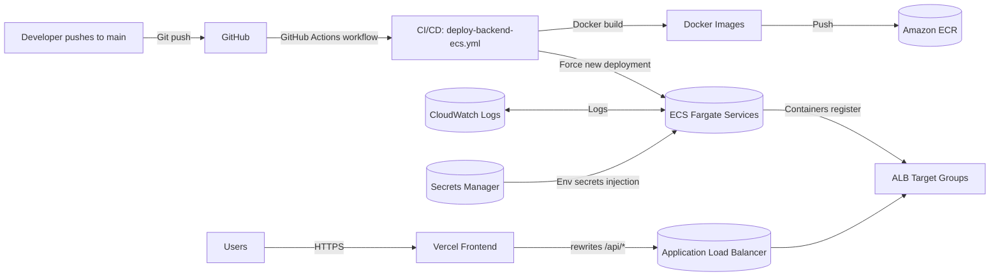

# 1.8 Deployments / CI/CD Pipeline

This section explains how **CeylonRoam** is deployed end-to-end, and how changes flow from GitHub to production.

## 1) Deployment Targets (What runs where)

- **Source control:** GitHub repository (main branch)
- **Frontend:** Vercel (React + Vite)
- **Backend:** AWS ECS (Fargate) microservices (containerized)
  - `auth-service` (Node/Express)
  - `itinerary-service` (FastAPI)
  - `route-optimizer-service` (FastAPI)
  - `voice-translation-service` (FastAPI)
- **Container registry:** Amazon ECR (one repo per microservice)
- **Ingress / routing:** AWS Application Load Balancer (ALB)
- **Secrets:** AWS Secrets Manager
- **Logs:** AWS CloudWatch Logs

### Screenshot placeholders

Add the following screenshots to support this section:

- `screenshots/cicd/01-architecture-overview.png`
  - *Capture:* A simple architecture diagram (you can paste a screenshot of the diagram in Section 2).
  - *Justification:* Helps the reader visualize the components and their responsibilities.

---

## 2) High-level Pipeline Diagram

> You can render the diagram below with Mermaid (many Markdown renderers support it).

### Why this architecture?

- **Microservices:** isolates workloads (AI itinerary, route optimization, translation) so each can scale independently.
- **Containers:** consistent runtime across local dev, CI, and production.
- **ECS Fargate:** avoids server management; AWS handles scheduling and scaling.
- **ALB:** single stable entry point for multiple backend services.
- **Secrets Manager:** prevents hardcoding credentials in code or config.
- **CloudWatch:** centralized logging for debugging and monitoring.

---

## 3) Backend CI/CD (GitHub Actions -> Amazon ECR -> ECS)

The automated pipeline for the backend is defined in:
- `.github/workflows/deploy-backend-ecs.yml`

### 3.1 Trigger (When the pipeline runs)

The workflow runs when:
- A commit is pushed to **`main`**, and
- The change touches `backend/**` (or the workflow file itself)

**Justification:** limits deployments to backend changes and avoids redeploying on frontend-only updates.

**Screenshot:** `screenshots/cicd/02-github-actions-trigger.png`
- *Capture:* The workflow YAML trigger section and/or the Actions run history.

### 3.2 Secure AWS Authentication (OIDC)

The workflow uses **GitHub OIDC** to assume an AWS IAM role:
- `aws-actions/configure-aws-credentials@v4`
- AWS role ARN is provided via repository secret: `AWS_ROLE_TO_ASSUME`

**Justification:**
- No long-lived AWS access keys stored in GitHub.
- Role permissions can be scoped to only what the pipeline needs (ECR push + ECS update-service).

**Screenshot:** `screenshots/cicd/03-aws-oidc-role.png`
- *Capture:* GitHub repo secrets (showing `AWS_ROLE_TO_ASSUME` without revealing the full ARN) and the IAM role trust policy (GitHub OIDC provider).

### 3.3 Build + Push Docker Images (per microservice)

For each service, the workflow:
1. Builds a Docker image
2. Tags it twice:
   - `:latest` (for ECS task definitions)
   - `:${GITHUB_SHA}` (for traceability)
3. Pushes to ECR

Example (auth service):
- Build context: `backend/authService`
- ECR repo: `ceylonroam-auth`

**Justification:**
- **`:latest`** keeps ECS task definitions simple (static JSON files can reference a stable tag).
- **`:${GITHUB_SHA}`** provides a unique, immutable tag for audits and rollbacks.

**Screenshot:** `screenshots/cicd/04-ecr-image-tags.png`
- *Capture:* ECR repository showing `latest` and commit SHA tags.

### 3.4 Deploy Step (Trigger ECS rolling deployments)

After pushing images, the workflow triggers rolling updates:

- `aws ecs update-service --force-new-deployment`

This is executed for all four ECS services:
- `auth-service`
- `itinerary-service`
- `route-optimizer-service`
- `voice-translation-service`

**Justification:**
- Forces ECS to pull the newest `:latest` image and start new tasks.
- Rolling update keeps service available while replacing tasks.

**Screenshot:** `screenshots/cicd/05-ecs-service-events.png`
- *Capture:* ECS service events showing a new deployment, and task replacement.

### 3.5 Observability (Logs + Health)

- Each task definition is configured with **CloudWatch Logs** (log group per service).
- ALB target groups use `/health` endpoints for health checks.

**Justification:**
- Centralized logs make failures visible immediately after deploy.
- Health checks prevent routing traffic to unhealthy tasks.

**Screenshots:**
- `screenshots/cicd/06-cloudwatch-log-groups.png` (log groups list)
- `screenshots/cicd/07-target-group-health.png` (target group healthy targets)

---

## 4) Backend Infrastructure Provisioning (one-time / occasional)

The CI/CD workflow assumes AWS infrastructure already exists.
The repository includes scripts to provision/update this:

- `backend/aws/deploy.sh` / `backend/aws/deploy.bat`
  - Creates ECR repos, CloudWatch log groups, registers ECS task definitions.
  - Substitutes account/region placeholders and resolves Secrets Manager ARNs.

- `backend/aws/provision-infra.ps1`
  - Creates/updates ALB + security groups.
  - Creates target groups and listeners (ports 80, 8001, 8002, 8003).

- `backend/aws/create-ecs-services.ps1`
  - Creates ECS services and attaches each one to its target group.

**Justification:**
- Keeps infrastructure setup repeatable and reviewable.
- Separates “infra creation” from “app deployments” (CI/CD runs fast and safely).

**Screenshots:**
- `screenshots/cicd/08-alb-listeners.png` (ALB listeners)
- `screenshots/cicd/09-ecs-cluster-services.png` (ECS cluster services list)
- `screenshots/cicd/10-secrets-manager-secrets.png` (Secrets Manager secret names only)

---

## 5) Frontend Deployment (Vercel)

Frontend is deployed via Vercel. The project uses `vercel.json` rewrites so the frontend can call backend APIs without exposing multiple backend URLs directly in the client.

- Root rewrite config: `vercel.json`
- Frontend rewrite config: `frontend/vercel.json`

These rewrites forward paths like:
- `/api/generate` -> `http://<ALB_DNS>:8001/api/generate`

**Justification:**
- Keeps the frontend API base path stable (`/api/...`).
- Avoids hardcoding multiple service ports in the client.
- Simplifies CORS considerations by routing via a single frontend origin.

**Screenshots:**
- `screenshots/cicd/11-vercel-deployments.png` (Vercel deployments list)
- `screenshots/cicd/12-vercel-rewrites.png` (vercel.json rewrites snippet)

---

## 6) Rollback Strategy (practical approach)

Because images are also tagged with the commit SHA, rollback can be done by:

- Retagging a known-good SHA as `latest`, or
- Updating task definitions to reference a fixed SHA tag (manual emergency change)

**Justification:**
- SHA tags provide an exact version that can be re-deployed.

---

## 7) Summary of Key Justifications

- **GitHub Actions:** automated deployments on every backend merge to main.
- **OIDC role assumption:** reduces secret leakage risk vs static access keys.
- **ECR per service:** clear isolation and independent versioning.
- **ECS force-new-deployment:** simple rolling updates without manual restarts.
- **CloudWatch + health checks:** fast diagnosis and safer traffic routing.
- **Vercel rewrites:** clean API surface for the frontend.
