# 1.8 Deployments / CI/CD Pipeline

This section explains how **CeylonRoam** is deployed end-to-end, and how changes flow from GitHub to production.

---

## 1) Deployment Targets (What runs where)

| Component | Platform | Details |
|-----------|----------|---------|
| Source control | GitHub (`main` branch) | Triggers both frontend and backend pipelines |
| Frontend | Vercel (React + Vite) | Auto-deployed on every push to `main` |
| auth-service | AWS ECS Fargate | Node/Express · port 5001 / ALB 80 |
| itinerary-service | AWS ECS Fargate | FastAPI · port 8001 |
| route-optimizer-service | AWS ECS Fargate | FastAPI · port 8002 |
| voice-translation-service | AWS ECS Fargate | FastAPI · port 8003 |
| Container registry | Amazon ECR | One repository per microservice |
| Ingress / routing | AWS Application Load Balancer | Single DNS entry, four listener ports |
| Secrets | AWS Secrets Manager | Injected at container launch |
| Logs | AWS CloudWatch Logs | `/ecs/<service>` log groups |

### Architecture Overview

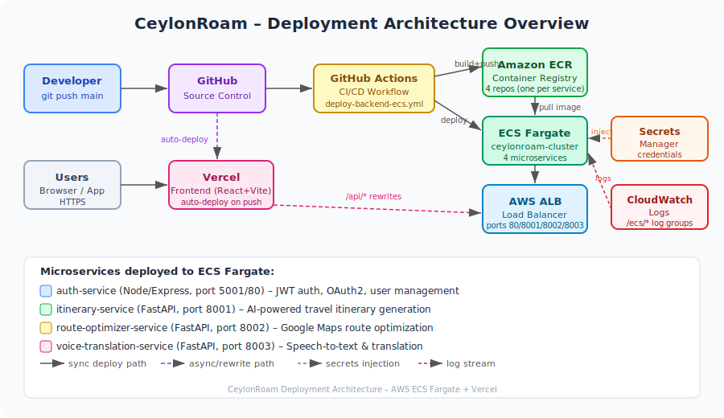

> **Justification:** A single diagram illustrates all components and their responsibilities at a glance, making it easy to trace the path of a change from developer commit to production user.

---

## 2) High-level Pipeline Diagram

> The Mermaid diagram below captures the same flow as the architecture diagram above.

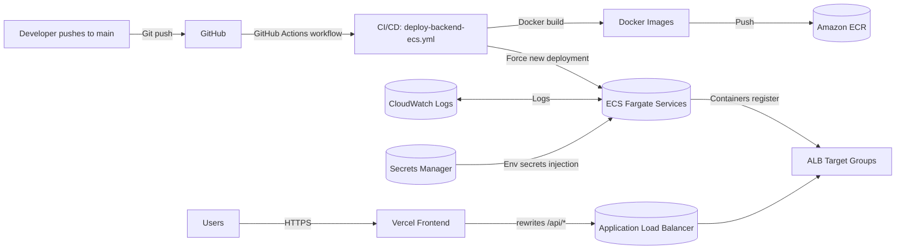

### Why this architecture?

- **Microservices:** isolates workloads (AI itinerary, route optimization, translation) so each can scale independently.
- **Containers:** consistent runtime across local dev, CI, and production.
- **ECS Fargate:** avoids server management; AWS handles scheduling and scaling.
- **ALB:** single stable entry point for multiple backend services.
- **Secrets Manager:** prevents hardcoding credentials in code or config.
- **CloudWatch:** centralized logging for debugging and monitoring.

---

## 3) Backend CI/CD (GitHub Actions → Amazon ECR → ECS)

The automated pipeline for the backend is defined in:
- `.github/workflows/deploy-backend-ecs.yml`

### 3.1 Trigger (When the pipeline runs)

The workflow runs when:
- A commit is pushed to **`main`**, and
- The change touches `backend/**` (or the workflow file itself)

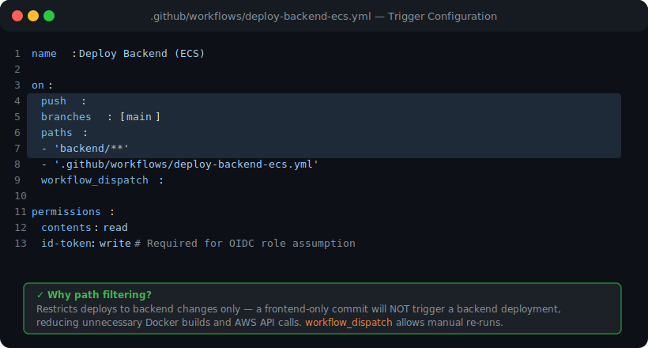

**Justification:** Path filtering limits deployments to backend changes only — a frontend-only commit will **not** trigger a backend deployment, reducing unnecessary Docker builds and AWS API calls. The `workflow_dispatch` event also allows manual re-runs at any time.

---

### 3.2 Secure AWS Authentication (OIDC)

The workflow uses **GitHub OIDC** to assume an AWS IAM role — no long-lived access keys are stored anywhere.

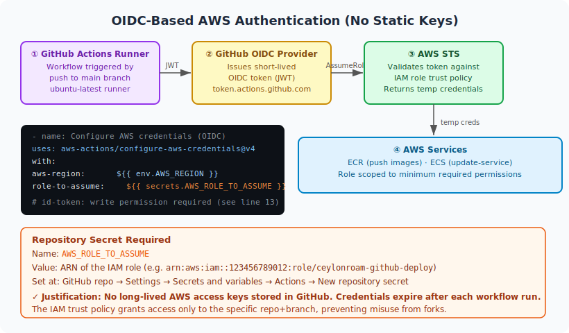

**How it works:**
1. GitHub Actions runner requests a short-lived OIDC token from `token.actions.github.com`.
2. The token is exchanged with AWS STS via `aws-actions/configure-aws-credentials@v4`.
3. STS validates the token against the IAM role's trust policy (which pins the token to this specific repo and branch).
4. Temporary credentials are returned — valid only for the duration of the workflow run.

**Required repository secret:**

| Secret name | Value |
|-------------|-------|
| `AWS_ROLE_TO_ASSUME` | ARN of the IAM role (e.g. `arn:aws:iam::123456789012:role/ceylonroam-github-deploy`) |

**Justification:**
- No long-lived AWS access keys stored in GitHub — credentials expire automatically after each run.
- Role permissions are scoped to only what the pipeline needs (ECR push + ECS `update-service`).
- The IAM trust policy grants access only to the specific repository and branch, preventing abuse from forks.

---

### 3.3 Build + Push Docker Images (per microservice)

For each service the workflow:
1. Builds a Docker image from the service's source directory.
2. Tags it **twice**: `:latest` and `:<GITHUB_SHA>` (full 40-character commit SHA).
3. Pushes both tags to ECR with `docker push --all-tags`.

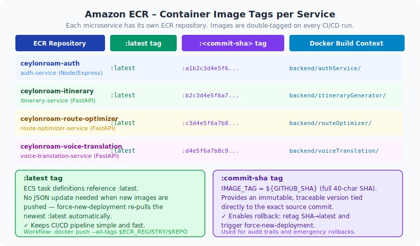

| ECR Repository | Docker Build Context | Purpose |
|---------------|----------------------|---------|
| `ceylonroam-auth` | `backend/authService/` | JWT auth, OAuth2, user management |
| `ceylonroam-itinerary` | `backend/itineraryGenerator/` | AI-powered itinerary generation |
| `ceylonroam-route-optimizer` | `backend/routeOptimizer/` | Google Maps route optimization |
| `ceylonroam-voice-translation` | `backend/voiceTranslation/` | Speech-to-text & translation |

**Justification:**
- **`:latest`** keeps ECS task definitions simple — the static JSON files reference a stable tag and never need updating between deployments.
- **`:<GITHUB_SHA>`** provides an immutable, traceable version tied directly to the exact source commit, enabling audits and rollbacks.

---

### 3.4 Deploy Step (Trigger ECS rolling deployments)

After pushing images the workflow triggers rolling updates with:

```bash
aws ecs update-service --cluster "$ECS_CLUSTER" --service "$SERVICE_NAME" --force-new-deployment
```

Executed for all four ECS services in parallel.

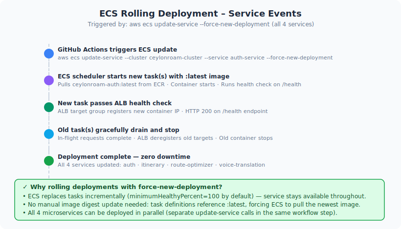

**Justification:**
- `--force-new-deployment` tells ECS to pull the newest `:latest` image and start replacement tasks even when the task definition has not changed.
- Rolling update (ECS default `minimumHealthyPercent = 100`) keeps the service available throughout — users never see downtime.
- All four microservices are updated in the same workflow run.

---

### 3.5 Observability (Logs + Health)

Each task definition is configured with **CloudWatch Logs** via the `awslogs` log driver.
ALB target groups perform active health checks on the `/health` endpoint of each service.

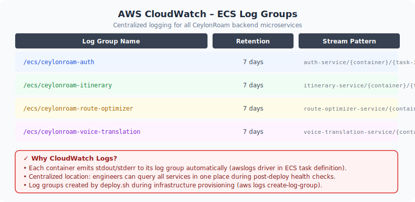

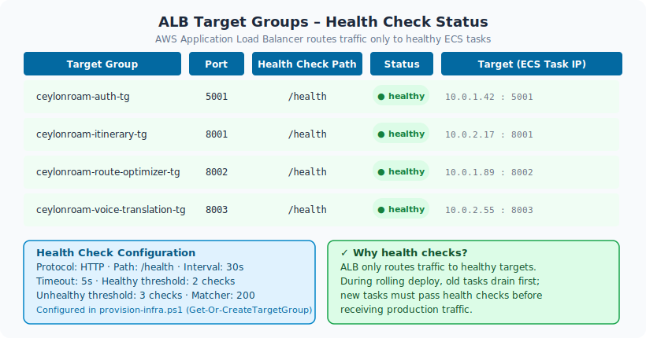

**Justification:**
- Centralized logs make failures visible immediately after a deploy — engineers query a single AWS Console location instead of SSH-ing into containers.
- Health checks prevent the ALB from routing traffic to unhealthy tasks; during a rolling deploy new tasks must pass health checks before receiving production traffic.

---

## 4) Backend Infrastructure Provisioning (one-time / occasional)

The CI/CD workflow assumes AWS infrastructure already exists. The repository includes scripts to provision or update it:

| Script | Purpose |
|--------|---------|
| `backend/aws/deploy.sh` / `deploy.bat` | Creates ECR repos, CloudWatch log groups, registers ECS task definitions. Substitutes account/region placeholders and resolves Secrets Manager ARNs. |
| `backend/aws/provision-infra.ps1` | Creates/updates ALB, security groups, target groups, and listeners (ports 80, 8001, 8002, 8003). |
| `backend/aws/create-ecs-services.ps1` | Creates ECS services and attaches each one to its target group. |

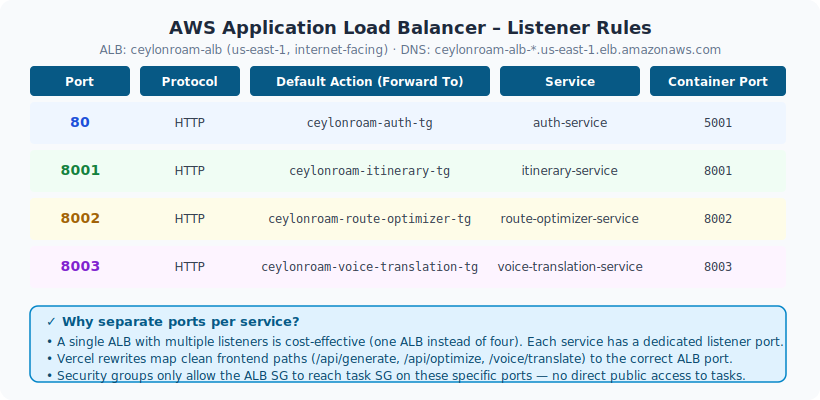

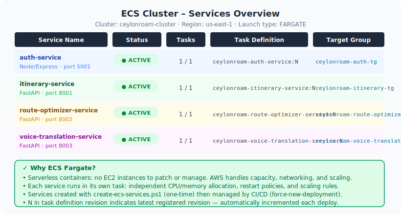

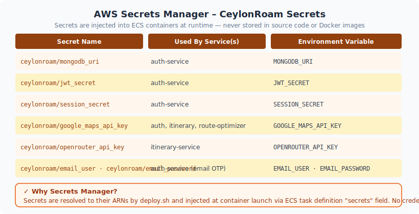

**Justification:**
- Infrastructure-as-code scripts keep the setup repeatable, reviewable, and reproducible on a fresh AWS account.
- Separating "infra creation" (one-time scripts) from "app deployment" (CI/CD) means the CI/CD workflow runs fast and never risks accidentally destroying infrastructure.

---

## 5) Frontend Deployment (Vercel)

The frontend is deployed via **Vercel**. Every push to `main` triggers an automatic production deployment; every pull request gets a preview deployment at a unique URL.

The project uses `vercel.json` rewrites so the frontend can call backend APIs without exposing multiple backend service ports directly to the browser.

- Root rewrite config: `vercel.json`
- Frontend rewrite config: `frontend/vercel.json`

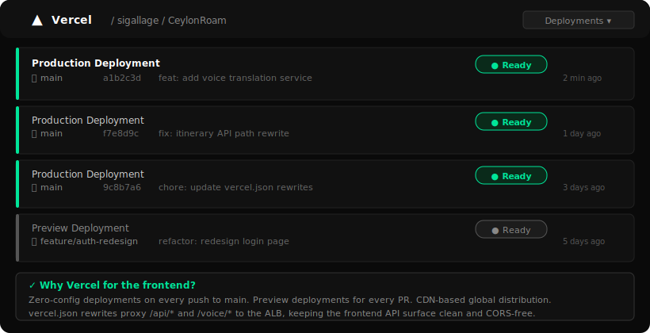

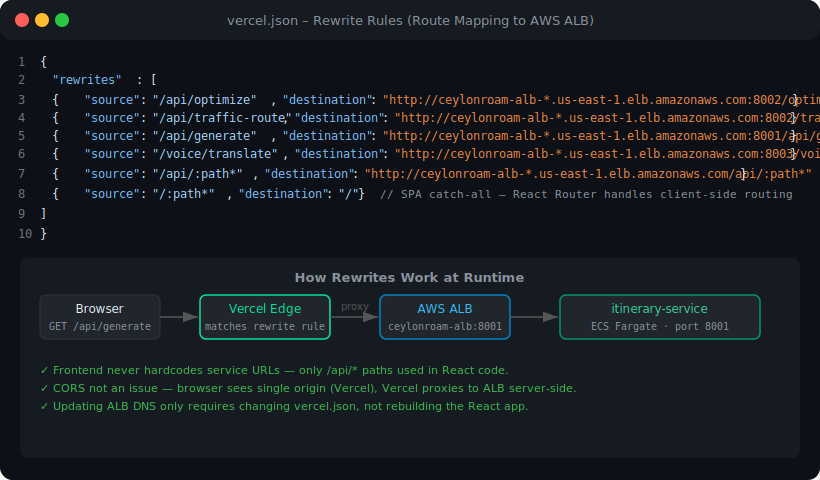

**Rewrite examples:**

| Frontend path | Proxied to (ALB) |
|--------------|------------------|
| `/api/generate` | `http://<ALB_DNS>:8001/api/generate` (itinerary-service) |
| `/api/optimize` | `http://<ALB_DNS>:8002/optimize` (route-optimizer-service) |
| `/voice/translate` | `http://<ALB_DNS>:8003/voice/translate` (voice-translation-service) |
| `/api/:path*` | `http://<ALB_DNS>/api/:path*` (auth-service catch-all) |
| `/:path*` | `/` (SPA catch-all — React Router handles client-side routing) |

**Justification:**
- The React codebase only ever calls `/api/...` paths — the ALB DNS is never hardcoded in client-side JavaScript.
- CORS is non-issue: the browser sends requests to the Vercel origin; Vercel proxies server-side to the ALB.
- Changing the ALB DNS requires updating only `vercel.json`, not rebuilding the React application.

---

## 6) Rollback Strategy

Because every image is tagged with the commit SHA, rollback is straightforward. **Repeat the commands below for each affected service** (`ceylonroam-auth`, `ceylonroam-itinerary`, `ceylonroam-route-optimizer`, `ceylonroam-voice-translation`):

```bash
# Variables — set these for each service you need to roll back
REPO=ceylonroam-auth          # change per service
SERVICE=auth-service          # change per service
GOOD_SHA=<good-commit-sha>    # full 40-char SHA of a known-good image

# 1. Re-tag the known-good image as :latest in ECR
aws ecr batch-get-image \
  --repository-name "$REPO" \
  --image-ids imageTag="$GOOD_SHA" \
  --query 'images[].imageManifest' --output text \
| aws ecr put-image \
  --repository-name "$REPO" \
  --image-tag latest \
  --image-manifest -

# 2. Trigger a rolling deployment to pick up the re-tagged :latest
aws ecs update-service \
  --cluster ceylonroam-cluster \
  --service "$SERVICE" \
  --force-new-deployment
```

**Justification:**
- SHA tags provide an exact, immutable snapshot of any previously working image — no rebuild required.
- Re-tagging takes seconds; combined with `force-new-deployment` the rollback is live within the normal ECS rolling-update window.
- Each service can be rolled back independently, so a bad itinerary-service deploy does not require rolling back the auth-service.

---

## 7) Summary of Key Justifications

| Decision | Justification |
|----------|---------------|
| **GitHub Actions** | Automated deployments on every backend merge to `main`; free for public repos; native OIDC support |
| **OIDC role assumption** | No long-lived AWS keys; credentials auto-expire; role scoped to minimum permissions |
| **ECR per service** | Clear isolation; independent versioning; services can be updated or rolled back individually |
| **`:latest` + `:<sha>` tags** | `:latest` keeps CI simple; `:<sha>` enables precise audit and rollback |
| **ECS `force-new-deployment`** | Simple rolling updates without manual task definition changes |
| **CloudWatch + health checks** | Fast post-deploy diagnostics; traffic only routes to healthy tasks |
| **Vercel rewrites** | Clean `/api/*` surface for React code; no CORS complexity; single config change to update ALB |
| **Infra scripts separate from CI/CD** | Infra creation is rare/one-time; keeping it out of CI/CD prevents accidental infra destruction |
